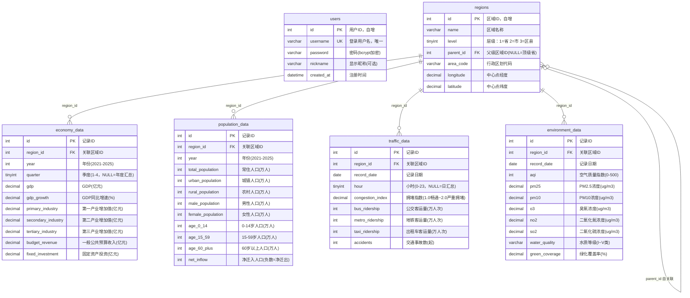

# 数据库表关联关系图

数据库：`city_insight`（MySQL，InnoDB，utf8mb4）

## ER 图

## 关系说明

| 关系 | 类型 | 说明 |
|---|---|---|
| `regions.parent_id → regions.id` | 自关联，1:N | 省市区三级树：省(parent_id=NULL) → 16市 → 104区县，共 121 条 |
| `economy_data.region_id → regions.id` | 1:N，`ON DELETE CASCADE` | 省/市/区县全部三级均有数据（省另有季度粒度） |
| `population_data.region_id → regions.id` | 1:N，`ON DELETE CASCADE` | 年度粒度，覆盖三级 |
| `traffic_data.region_id → regions.id` | 1:N，`ON DELETE CASCADE` | 月粒度（每月一条，hour 恒 NULL） |
| `environment_data.region_id → regions.id` | 1:N，`ON DELETE CASCADE` | 月粒度，覆盖三级 |
| `users` | 独立表 | 与业务数据无关联 |

## 设计要点（面试点）

1. **为什么 regions 用 `parent_id` 自关联而不是三张表？**
   - 层级结构统一：三级共用同一套字段（name/area_code/经纬度），增删层级（未来扩展乡镇）不需要加表
   - 查询简单：`WHERE parent_id = ?` 一条语句即可取任意层级的直接子级，配合 `level` 字段过滤层级
   - 地图下钻天然匹配：省→市→区县都是"找 children"这一个动作

2. **为什么加这些索引？**
   - `regions(parent_id)`、`regions(level)`：下钻查询最频繁的两个条件
   - 业务表 `(region_id, year)` / `(region_id, record_date)` 联合索引：所有业务接口都按"区域 + 时间"过滤，联合索引一次命中；单列 `(year)` / `(record_date)` 索引服务于跨区域的时间范围统计（如全平台某年汇总）

3. **为什么业务表统一外键指向 regions 并 `ON DELETE CASCADE`？**
   - 数据随区域级联清理，避免孤儿数据；配合 seed 脚本的 `TRUNCATE` 重灌流程不会留下脏数据

## 渲染方式

- GitHub / VS Code（安装 Markdown Preview Mermaid 插件）/ Typora 均可直接渲染本文件
- 需要 PNG 图片时可用 mermaid-cli：`npx @mermaid-js/mermaid-cli -i docs/database-er-diagram.md -o docs/database-er-diagram.png`
