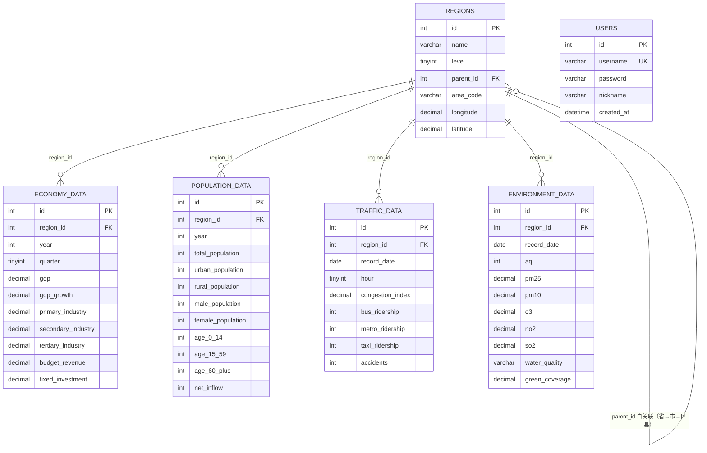

# city_insight 数据库表关系图（Mermaid 版）

> 与 `db-er-diagram.svg` 内容一致。本文件提交到 GitHub 后会自动渲染成图，也可在 Typora / VS Code（安装 Mermaid 插件）中预览。

## 关系说明

| 关系 | 类型 | 说明 |
| --- | --- | --- |
| regions.parent_id → regions.id | 自关联 1:N | 省 → 市 → 区县 三级树形结构，`parent_id=NULL` 表示省级 |
| economy_data.region_id → regions.id | 多对一 | 经济数据按区域 + 年份（+ 季度）维度 |
| population_data.region_id → regions.id | 多对一 | 人口数据按区域 + 年份维度 |
| traffic_data.region_id → regions.id | 多对一 | 交通数据按区域 + 日期（+ 小时）维度 |
| environment_data.region_id → regions.id | 多对一 | 环境数据按区域 + 日期维度 |

所有业务表外键均为 `ON DELETE CASCADE`：删除区域时级联删除其下所有业务数据。
